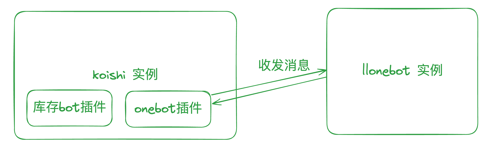
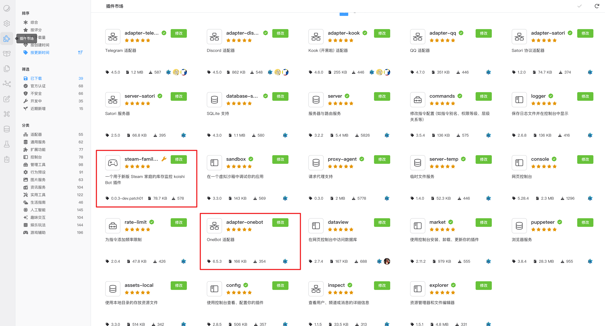
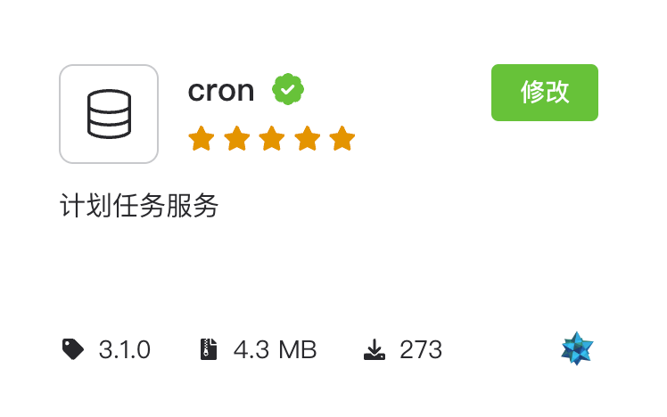
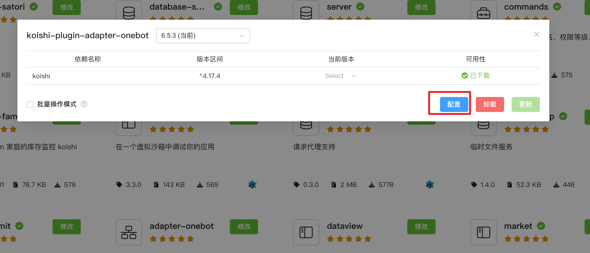
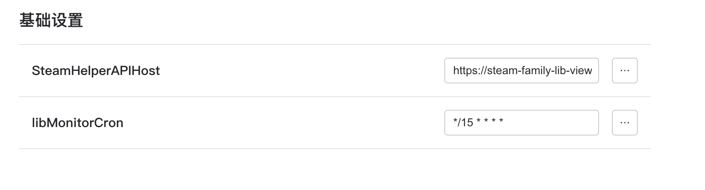
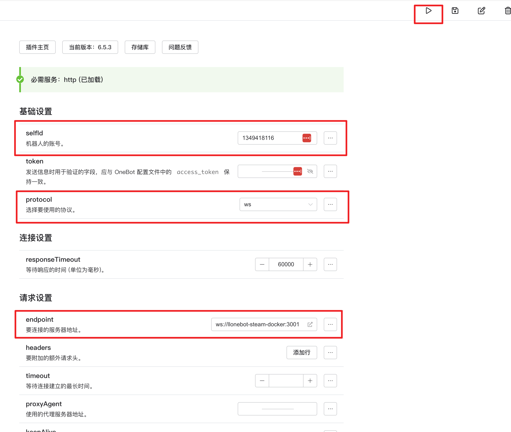
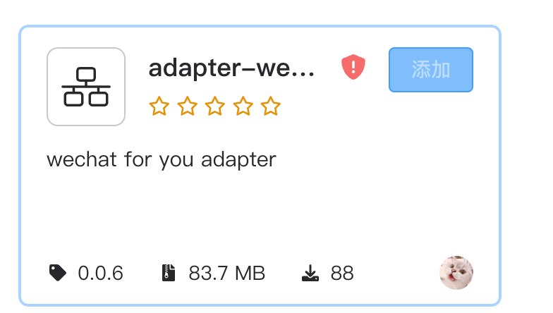
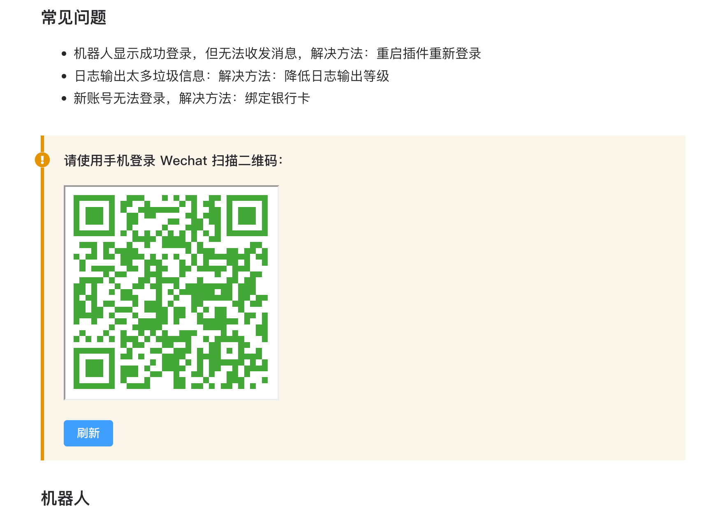
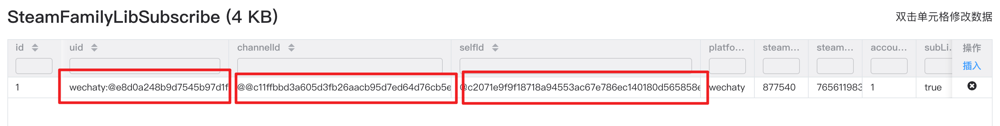

# Steam 家庭库存监控自部署指南

## Prerequisites

1. 需要一个号来充当机器人

### 其他参考文档
- [koishi](https://koishi.chat/zh-CN/manual/starter/)
- [llonebot](https://llonebot.github.io/zh-CN/guide/getting-started)

## QQBot 篇

QQ 官方在前段时间推出了自己的机器人服务。

[qq 官方机器人文档](https://bot.q.qq.com/wiki/)

作为个人开发者，申请流程还是很简单的。

但默认个人开发者的机器人只能给频道用（你也可以给你的家庭组个频道），还是很受限的。

好处是不需要自己提供一个 qq 号作为机器人实例。

因此在这里介绍我正在使用的 onebot，你需要一个 qq 小号来作为机器人。

onebot 是定义了通过网络服务提供 QQ 消息收发能力的一个协议。

[llonebot](https://github.com/LLOneBot/LLOneBot) 则是基于新版 NTQQ 的 onebot 协议实现。

整体结构如下：



不难看出，你需要自行部署 koishi 实例 + llonebot 实例。这里推荐使用 docker compose。
当然你也可以按对应的文档自行部署。
以下为示例 docker compose
```yaml
services:
  koishi-steam:
    image: aktdocker/koishi:v1.20.1
    tty: true
    container_name: koishi_steam
    restart: always
    environment:
      - TZ:"Asia/Shanghai"
    volumes:
      - koishi_steam:/koishi
    ports:
      - "5140:5140"
    networks:
      - steam-bot
  steam-llonebot:
    image: mlikiowa/llonebot-docker:vnc
    tty: true
    container_name: llonebot-steam-docker
    restart: always
    ports:
      - "5900:5900"
      - "3000:3000"
      - "3001:3001"
      - "6099:6099"
    environment:
      - TZ=Asia/Shanghai
      - VNC_PASSWD=vncpasswd
    volumes:
      - llonebot_steam:/opt/QQ/resources/app/LiteLoader
    labels:
      - "traefik.docker.network=traefik"

    networks:
      - steam-bot

volumes:
  llonebot_steam:
  koishi_steam:
networks:
  steam-bot:
    name: steam-bot
```

在启动了 koishi 实例后，打开 http://实例ip:端口，比如 http://127.0.0.1:5140。进入 koishi 控制台。


进入插件市场，下载 adapter-onebot、steam-family-bot、cron 三个插件。



点击配置进行插件配置。

首先启用 cron 插件，他负责为 steam-family-bot 提供定时任务服务。



对于 steam-family-bot 插件，无需额外配置。`libMonitorCron` 是触发 steam 库存检查的时间，默认 15min 一次。




对于 adapter-onebot 插件。

`selfId` 填入充当机器人的 qq 号。

`protocol` 字段选择 `ws`（`ws-reverse`也可用，但需要在llonebot进行额外配置)

在启动了 llonebot 实例后，打开特定地址，此处 127.0.0.1 应当替换为自己的实例地址(如果是本地使用保持 127.0.0.1也ok)，然后打开 `http://127.0.0.1:6099/api/panel/getQQLoginQRcode`

可以看到 QQ 二维码。用上面的qq号扫描即可登陆。

`endpoint` 字段：

如果你是用上面的 docker-compose 文件，那么填入 `ws://llonebot-steam-docker:3001` 就好了。

如果不是，则根据实际情况填入llonebot 实例相对于 koishi 实例的地址。

随后回到 koishi 的 adapter-onebot 的插件设置，启用插件即可。



至此部署完成。

与 qq 机器人对话，按照需要进行登陆，订阅通知即可。

### NapCatQQ

上面的 QQ 是通过 LLonebot 登陆的，另外一个平替是 NapCatQQ。

其优势是内存占用小，但是相对于 llonebot 来说没有图形界面，因此要定制一些配置会更复杂。

对应的 docker-compose 文件如下

```yaml
services:
  koishi-steam:
    image: aktdocker/koishi:v1.20.1
    tty: true
    container_name: koishi
    restart: always
    environment:
      - TZ:"Asia/Shanghai"
    volumes:
      - koishi:/koishi
    ports:
      - "5140:5140"
    networks:
      - steam-bot
  napcat:
    image: mlikiowa/napcat-docker:latest
    environment:
      - ACCOUNT=<改为 Bot 的QQ号>
      - WS_ENABLE=true
    ports:
      - 3001:3001
      - 6099:6099
    container_name: napcat
    volumes:
      - napcat_cfg:/root/.config/QQ
    restart: always
    networks:
      - steam-bot
volumes:
  napcat_cfg:
  koishi:
networks:
  steam-bot:
    name: steam-bot
```


在启动了 llonebot 实例后，查看日志，如果你使用的是 Docker。
使用 `docker logs napcat` 命令可以看到 QQ 二维码。用登陆上面 qq 号的手机扫描即可登陆。

`endpoint` 字段：

如果你是用上面的 docker-compose 文件，那么填入 `ws://napcat:3001` 就好了。

如果不是，则根据实际情况填入 napcat 实例相对于 koishi 实例的地址。

随后回到 koishi 的 adapter-onebot 的插件设置，启用插件即可。

## 微信篇
### 微信 bot 限制

建议先阅读 QQ 篇。

与 上文类似，启动了 koishi 之后，进入插件市场，
安装 **adapter-wechat4u**、steam-family-bot、cron 三个插件。



参照上文在配置好 steam-family-bot、cron 两个插件后，进入 adapter-wechat4u 插件的配置
扫描二维码并登陆微信小号即可。



从原理上来说 这是在模拟 UOS 系统上的桌面微信。

下面是一些坑：
1. 每次重新登陆微信bot，接收到的用户id都会变化，这使得存储用户订阅信息变得不那么可用，因此在重新登陆后，你需要手动更改一些数据，使得通知功能能够继续生效。
   重新登陆并在群聊中发送消息后（推荐安装[inspect 插件](https://koishi.chat/zh-CN/manual/usage/platform.html)），拿到 频道ID(channelId)，bot自身ID(selfId)。


for v0.0.3
将steamFamilyLibSubscribe 表的 channelId,selfId 变更为拿到的最新值。


1. 你需要在一个手机上登陆微信bot账号，不可退出登陆，一旦手机退出登陆微信账号，桌面微信也会被强制退出。因此推荐双开微信。
